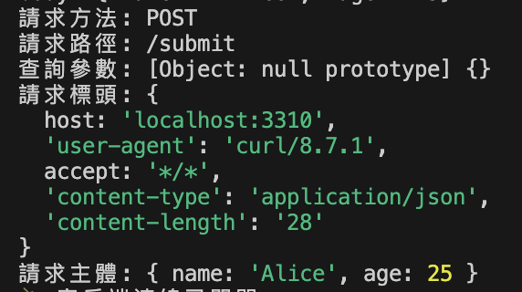

# Windmill.js

Windmill.js 是一個簡易的 Node.js HTTP 框架，提供路由註冊、靜態檔案服務、錯誤處理等功能，讓你快速建立自己的伺服器。

---

## 安裝與啟動

1. 將 windmill.js  到你的專案資料夾。

2. 在專案中建立 server.js，使用 Windmill 來註冊路由並啟動伺服器

| 路由             | 方法   | 功能描述                   | 參數          |
| -------------- | ---- | ---------------------- | -------------- |
| `/`            | GET  | 顯示首頁，包含歡迎訊息            | 無              |
| `/about`       | GET  | 重新導向到 /about.html             | 無              |
| `/api/user`    | GET  | 回傳指定 userId 的用戶資訊      | URL 查詢參數：`id`  |
| `/api/echo`    | POST | 回傳接收到的 JSON 請求體 | 請求體（JSON）      |
| 靜態資源目錄         | N/A  | 提供 public 目錄下的靜態檔案     | 靜態檔案（由請求路徑指定）  |
| 自訂 404 頁面      | N/A  | 所有未匹配路由時呼叫             | 無              |
| 全域錯誤處理         | N/A  | 所有路由錯誤時觸發              | 錯誤物件           |

## 使用說明

### 1. 路由：get(path, handler) 與 post(path, handler)

  - 功能說明： 註冊 GET 或 POST 請求的路由與對應處理函式。
  - 使用範例：

    ```javascript
      const app = createApp();
      app.get('/', (req, res) => {
        res.send('<h1>Hello, Windmill!</h1>');
      });
      app.post('/submit', (req, res) => {
        console.log('Received data:', req.body);
        res.json({ success: true });
      });
    ```

### 2. request

  - 使用範例：
    ```javascript
      app.post('/api', (req, res) => {
        console.log('請求方法:', req.method); 
        console.log('請求路徑:', req.path); 
        console.log('查詢參數:', req.query); 
        console.log('請求標頭:', req.headers);
        console.log('請求主體:', req.body); 
        res.json({ message: '資料已接收' });
      });
    ```

- 終端機輸入

  ```
    curl -X POST http://localhost:3310/submit \
    -H "Content-Type: application/json" \
    -d '{"name": "Alice", "age": 25}'
  ```

- 伺服器回傳

    

### 3. response

- 常用方法：
  - setHeader(name, value)：設定回應標頭
  - writeHead(statusCode, headers)：設定狀態碼與標頭
  - end(content)：發送回應並結束
  - send(body)：自動判斷是 HTML / JSON 並回應
  - status(code)：鏈式設定狀態碼
  - json(data)：直接送出 JSON 格式資料
  - redirect：302（Found）導向至新網址

  - 使用範例： POST /api/echo 可以從 echo.html 測試

    ``` javascript
      app.get('/api/user', (req, res) => {
        console.log("進入 /api/user 路由，req.query=", req.query);
        const userId = req.query.id; // 假設 URL 是 /api/user?id=123
        if (userId === '123') {
          res.json({ id: userId, name: '實習生小明', message: '成功使用 req.query 和 res.json!' });
        } else {
          res.status(404).json({ error: 'User not found' });
        }
      });

      app.post('/api/echo', (req, res) => {
        res.json({ received: req.body, message: 'Data echoed!' });
      });
    ```

### 4. 靜態檔案：static(dir)

   - 功能說明：提供目錄下的靜態檔案服務，例如 HTML、CSS、JS、圖片等。
   - 使用方式：`app.static('./public');` ，設定 public 資料夾作為靜態檔案的根目錄。
   - 位於 public 裡面的 index.html ，直接透過對應的路徑（例如 /index.html）被訪問
   - 當訪問根路徑 / 時，如果 public 資料夾中存在 index.html ，伺服器會自動回應該該檔案作為預設首頁。

### 5. 自訂 404：notFound(handler)

- 功能說明：當找不到對應路由時，框架預設會回傳靜態資料夾底下的 NotFound.html 作為 404 頁面。
- 使用方式：在 `public` 資料夾中放置 `NotFound.html`。  

### 6. 錯誤處理：onError(handler)

- 功能說明： 處理所有路由中的錯誤（try/catch 中抓到的錯誤），並自訂錯誤頁面。
- 使用方式：

    ```javascript
      app.onError((err, req, res) => {
        console.error("噢不，發生了錯誤:", err.message);
        res.status(500).send(`<h1>伺服器內部錯誤: ${err.message}</h1>`);
      });
    ```

### 7. 啟動伺服器：listen(port, callback)

- 功能說明：啟動 TCP 伺服器，開始接收請求。
- 使用方式：
  
  ```  
    app.listen(3000, () => {
        console.log('🚀 Windmill is running on port 3000');
      });
  ```
